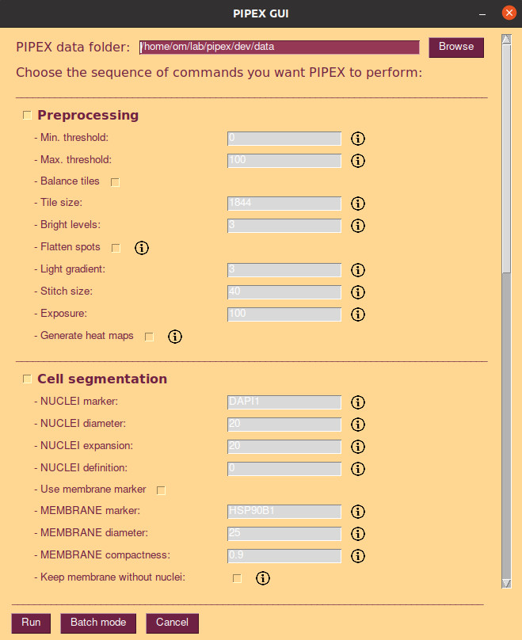

PIPEX
=====

PIPEX is a collection of commands, scripts and utilities featuring a flexible pipeline to transform the CODEX's resulting images into valuable analysis items. The available options offer a customizable cell segmentation (based on nuclei but with the possibility to refine it through a membrane marker), the automatic generation of a complete FCS CSV file and a configurable and extensive downstream analysis.

Key features
------------

- **Scripted cell segmentation** 
  - Based on Stardist DAPI nuclei segmentation, configurable cell expansion and optional membrane refinement if a marker is provided.
  - Resulting cell segmentation saved as a binary labelled numpy array. All intermediate steps stored as light weighted JPG images for quality control. 
- **Automatic generation of FCS file**
  - Direct calculation of segmented cells data and the desired markers intensities.
  - If downstream analysis is also performed, additional information (like clustering, interactions, etc...) will be appended to the file.
- **Downstream analysis**
  - Generates the selected results and plots for all the markers, storing them accordingly. 
- **Batch mode**
  - PIPEX can process sequentially different CODEX experiments with different configurations of all the above options

Why PIPEX
---------

  - Written entirely in python language, not tied to any specific program that might change and/or be discontinued in the future. Not even really tied to CODEX, can process any arbitrary set of images in a folder! 
  - More accurate cell segmentation compared to regular Stardist if a good membrane marker is provided.
  - PIPEX's generic results can be easily imported to other more graphical o interactive programs. As examples, PIPEX already includes a script to import the cell segmentation (and clusters, if calculated) to QuPath, a post-filtering option to adapt the mask to BIAS, etc...
  - The broad scope of the implemented downstream analysis automatically generates a large amount of labelled plots and data that can provide unexpected insights or be easily discarded otherwise.
  - Memory efficient, 10k resolution images can be handled by a 16GB regular machine without GPU. Virtually no size limit in linux through automatic swap memory management.
  - Quite fast: a full CODEX run of 20 antibodies with 6k resolution images takes 10min to fully process by PIPEX in 16Gb laptop (4min segmentation | 2min analysis | 1min QuPath conversion | 1min mask post-filtering).

  

Requirements
------------

- Currently, any linux distribution with python 3. [Note] a docker image is also provided.
- Enough RAM (and/or SSD hard disk to be used as swap memory in case of linux) to handle the working images' resolution. As a guideline:
  - Up to 6k resolution -> 8GB.
  - Up to 12k resolution -> 16GB. 
- NO GPU required, although it can speed up certain pipeline steps if available.

Installation
------------

- Install `python3`, `pip` and `virtualenv` in case you don't have them yet
- Navigate to your desired working directory
  - Example: `cd /home/lab/sandbox`
- Create a virtual environment:
  - Example: `python3 -m venv pipex`
- Unzip the contents of the `pipex.zip` inside your virtual environment directory
  - Following the example above, you should end having a bunch of files (`pipex.py`, `pipex_process.py`, etc...) in the folder `/home/lab/sandbox/pipex`
- Navigate to your virtual environment directory and run it:
  - Example: `source bin/activate`
- Install all requirements through pip:
  - Example: `pip install -r requirements.txt`
- Profit!

[Note] a docker image is also provided. Just remember to configure the environment variable for PIPEX's "work" directory.

Running PIPEX
------------- 

**NOTE**: remember that you have to access your PIPEX virtual environment before running any PIPEX script! To do so, navigate to your PIPEX working directory and activate it.
 - Example:
   - `cd /home/lab/sandbox`
   - `source bin/activate`

**Source images**

PIPEX requires an accessible folder (referred as "data folder" from now on) containing the images to process and will produce all the results in generated sub-folders. The data folder can contain other files and PIPEX does not modify the original images, but for security and cleanliness sake it's better if you copy the images in a new shiny data folder. 

The images in the data folder must reside in the base level (no sub-folders allowed) and must contain the name of the marker (protein) in the filename before the extension. 

*Example 1*: data folder created in {home}/pipeline/data with several images

**PIPEX commands**

PIPEX runs sequentially a series of commands written in the file `pipex_batch_list.txt` located in your installation folder. This is a simple txt file, with each command in a single line; you can add blank lines and comments (starting with "#" character) for easy readability.

There are currently available the following commands:

- `swap <number of GB>` : Linux only, it will generate a temporary swap space in the installation folder with the specified size; the space will be automatically deleted at the end of the full PIPEX process. **OBS**: it will require root permission/password while executing.

- `segmentation.py` : performs PIPEX segmentation. Uses the following parameters:
  - `-data=</path/to/images/folder>` : example -> -data=/home/lab/pipeline/data. **OBS**: this is the data folder
  - `-nuclei_marker=<name before . in image file>` : example, from image filename "reg001_cyc001_ch001_DAPI.tif"-> -nuclei_marker=DAPI
  - `-nuclei_diameter=<number of pixels>` : example -> -nuclei_diameter=20. **OBS**: this is an approximate guideline, Stardist is smart enough to adapt around 50% above and below.
  - `-nuclei_expansion=<number of pixels, can be 0>` : example -> -nuclei_expansion=20. **OBS**: the algorithm is smart enough to not overlap the expansions
  - `-nuclei_definition=<optional, gradation between 0.001 and 0.999>` : example -> -nuclei_definition=0.5. **OBS**: this instructs to Stardist algorithm to be less or more strict in its detections. Leave it empty or at 0 for default Stardist model value.
  - `-membrane_marker=<optional, name before . in image file>` : example, from image filename "reg001_cyc008_ch003_CDH1.tif" -> -membrane_marker=CDH1. **OBS**: if you don't use membrane marker you will obtain a basic Stardist segmentation with the specified nuclei expansion
  - `-membrane_diameter=<optional, number of pixels>` : example -> -membrane_diameter=25. **OBS**: required if membrane marker is used, this is an approximate guideline, the custom watershed segmentation is smart enough to adapt.
  - `-membrane_compactness=<optional, "squareness" of the membrane, gradation between 0.001 and 0.999>` : example -> -membrane_compactness=0.5. **OBS**: required if membrane marker is used, this instructs the watershed algorithm to try to keep a more or less (bigger value is more) square-type segmentation.
  - `-membrane_keep=<yes or no to keep segmented membranes without nuclei>` : example -> -membrane_keep=no. **OBS**: this will keep detected membrane segmentations without an underlying nuclei; useful for nuclei shapes not properly segmented by Stardist
  - `-adjust_images=<yes or no to enhance poor images>` : example -> -adjust_images=yes. **OBS**: this preprocess nuclei (and membrane if selected) images with poor contrast and/or intensity levels. Does not modify the original images and you can see the altered ones in the `quality\_control` sub-folder
  - `-measure_markers=<list of markers names before . in image files>` : example -> measure_markers=DAPI,CDH1,AMY2A,SST,GORASP2.

- `analysis.py` : performs PIPEX broad scope analysis. MUST be run AFTER a segmentation. Uses the following parameters:
  - `-data=</path/to/images/folder>` : example -> -data=/home/lab/pipeline/data. **OBS**: this is the data folder
  - `-image_size=<optional, one-side approximate resolution>` : example -> -image_size=1000. **OBS**: this refers to the resulting plot images' approximate resolution in pixels
  - `-analysis_markers=<optional, list of present specific markers to analyze>` : example -> -analysis_markers=AMY2A,SST,GORASP2. **OBS**: if this is not set, the analysis will use all present markers
  - `-cellsize_max=<optional, percentage of biggest cells to remove>` : example -> -cellsize_max=5. **OBS**: this refers to the percentge of the biggest cells to be remove for all analysis results
  - `-cellsize_min=<optional, percentage of smallest cells to remove>` : example -> -cellsize_min=5. **OBS**: this refers to the percentge of the smallest cells to be remove for all analysis results
  - `-custom_filter=<optional, yes or no to apply custom Cell Profiling lab's biomarkers filtering>` : example -> -custom_filter=yes. **OBS**: this will filter known biomarkers following Cell Profiling lab common tweaks.
  - `-log_norm=<optional, yes or no to apply log n + 1 normalization>` : example -> -log_norm=yes. **OBS**: this will apply a log1p normalization to the markers intensities
  - `-std_norm=<optional, yes or no to apply 0 to 1 re-scale normalization>` : example -> -std_norm=yes. **OBS**: this will apply a standard normalization to the markers intensities
  - `-batch_corr=<optional, name of the column in cell_data.csv to perform batch correction by>` : example -> -batch_corr=batch_id. **OBS**: this is the name of the column in the cell_data.csv that differentiates each experiment batch, so they can be separated to perform ComBat batch correction.
  - `-quantile_norm=<optional, yes or no to apply quantile normalization>` : example -> -quantile_norm=yes. **OBS**: this will apply an additional quantile normalization to the markers intensities
  - `-leiden=<optional, yes or no to perform leiden clustering>` : example -> -leiden=yes. **OBS**: this will perform a leiden clustering and all its associated data and plots
  - `-kmeans=<optional, yes or no to perform kmeans clustering>` : example -> -kmeans=yes. **OBS**: this will perform a kmeans clustering and all its associated data and plots.
  - `-elbow=<optional, yes or no to show elbow analysis for kmeans>` : example -> -elbow=yes. **OBS**: if kmeans is activated, this will perform a series of 20 kmeans clustering to display the resulting distortion and inertia plots.
  - `-k_clusters=<optional, force k number of cluster in kmeans>` : example -> -k_clusters=10. **OBS**: if kmeans is activated, this will use the specified number of k clusters. The default is 10.

- `generate_geojson.py` : generates a GEOjson file to be imported in QuPath. MUST be run AFTER a segmentation and optionally after an analysis (if you want the default clustering). Uses the following parameters:
  - `-data=</path/to/images/folder>` : example -> -data=/home/lab/pipeline/data. **OBS**: this is the data folder
  - `-expand=<optional, yes or no to add additional fields from cell_data.csv>` : example -> -expand=yes. **OBS**: this uses the `cluster_id` and `cluster_color` columns of the cell_data.csv to add clustering data to QuPath detections.
  
- `generate_filtered_masks.py` : can filter and/or tile the generated segmentation mask. It filters the cells present in the postprocessed mask by an arbritary column/values in the cell_data.csv file and/or cuts it in tiles of the specified size. Uses the following parameters:
  - `-data=</path/to/images/folder>` : example -> -data=/home/lab/pipeline/data. **OBS**: this is the data folder
  - `-field=<optional, name of the column in cell_data.csv to filter the cells by>` : example -> -field=cluster_id. **OBS**: this is the name of the column in the cell_data.csv for the mask to be filtered by
  - `-values=<optional, values, comma-separated, present in the selected colum of cell_data.csv to filter the cells by>` : example -> -values=3,6,7. **OBS**: if you create your custom column in the csv file you can filter the segementation by any logic.
  - `-tile_size=<optional, number of pixels of each square tile segmented>` : example -> -tile_size=2048. **OBS**: the tiles will always have a square shape (but see `-extend` option)
  - `-tile_overlap=<optional, number of pixels of surrounding overlap of each square tile segmented>` : example -> -tile_overlap=128. **OBS**: this is a fix pixel size option as oposed as `-tile_percentage`
  - `-tile_percentage_overlap=<optional, tile size\'s percentage of surrounding overlap of each square tile segmented>` : example -> -tile_percentage_overlap=10. **OBS**: this is a pixel percentage size option as oposed as `-tile_overlap`
  - `-extend_tile=<yes or no to have bigger border tiles>` : example -> -extend_tile=no. **OBS**: special option to have the last right and bottom border tile of the image extended to reach their limit if the image length and width does not match an exact tile size multiplier
  
- `preprocessing.py` : [BETA] preprocesses the images to try to fix common microscope acquisition problems. It can remove lower and/or upper intensities (background and/or artifacts), increase the exposure and/or generate a heat map. If the image suffers from severe tiling, preprocessing can try to help in different ways: reducing light gradients in each tile, homogenize the intensities of all the tiles and/or smooth the tile cuts. [NOTE] if more than one image is provided in the data folder, preprocessing will calculate all transforming operations in the first file and apply them equally in the rest of them; this is useful to modify proportionally all markers/channels present in the same original microscope image, which will most probably suffer of the same light/intensity problems.
  - `-data=</path/to/images/folder>` : example -> -data=/home/lab/pipeline/data. **OBS**: this is the data folder
  - `-threshold_min=<number, percentage of intensity>` : example -> -threshold_min=1. **OBS**: this is minimum percentage of the global intensity (the image limit) from which all intensities below will be deleted.
  - `-threshold_max=<number, percentage of intensity>` : example -> -threshold_min=99. **OBS**: this is maximum percentage of the global intensity (the image limit) from which all intensities above will be deleted.
  - `-balance_tiles=<yes or no>` : example -> -balance_tiles=yes. **OBS**: this activates the option to try to homogenize the intensities of all the tiles
  - `-tile_size=<number of pixels>` : example -> -tile_size=1844. **OBS**: this is the size of the image square tiles
  - `-bright_levels=<number, main levels of intensity in the image [normally 3-5 and their 2 selected focus]>` : example -> -bright_levels=4:1:3. **OBS**: this is the number of otsu thresholds to use while processing the image and the two ones selected as main intervals. If you use 0 it will default to 3:1:2 but provide a sample of many otsu intervals as output files.
  - `-light_gradient=<number, factor of complexity of light issues [1 to 4 should be enough]>` : example -> -light_gradient=3. **OBS**: this is the exponential value of squared sub-tiles that will be used to try to reduce the light gradients in each tile.
  - `-stitch_size=<number of pixels>` : example -> -stitch_size=20. **OBS**: this specifies the width of the region to use while performing the smooth operation in the tile cuts
  - `-exposure=<number, percentage of the base intensity>` : example -> -exposure=150. **OBS**: this increases the exposure of the image once it has been preprocessed
  - `-heat_map=<yes or no>` : example -> -heat_map=yes. **OBS**: this generates a heat_map of the preprocessed image
  
*Example 2*: contents of `pipex_batch_list.txt` for the images from *example 1*
<code>

    #my ubuntu laptop needs 8GB more of RAM to handle the images

    swap 8

    #running ESPACE experiment 3

    segmentation.py -data=/home/lab/pipeline/data -nuclei_marker=DAPI -nuclei_diameter=20 -nuclei_expansion=20 -membrane_marker=CDH1 -membrane_diameter=25 -adjust_images=yes -measure_markers=DAPI,CDH1,HLA-DR,CHGA,KRT5,IAPP,ACTA2,GORASP2,EZR,SST,TUFM,S100B,HSP90B1,Ki67,RBP4,AMY2A,NEFM,Panck,HLA-DR,GCG

    analysis.py -data=/home/lab/pipeline/data -image_size=1000 -leiden=yes

    #need full QuPath integration, with cluster

    generate_geojson.py -data=/home/lab/pipeline/data -expand=yes
</code>

**Run the script**

Once you have written in `pipex_batch_list.txt` the commands to be sequentially executed by PIPEX you just need to run the following command from the command line (**OBS**: you have to run this command from PIPEX's installation folder!):

`python3 pipex.py`

This will generate the following sub-folders and items inside the data folder:

- `analysis` folder: it contains the following items:
  - `segmentation_data.npy` file: the labelled cell regions in numpy array format (for further computing analysis)
  - `segmentation_data_filtered.npy` file: the filtered labelled cell regions in numpy array format (if you have executed the generate_filtered_masks step)
  - `segmentation_data_filtered_tile_X_X.npy` file: each tile of the filtered labelled cell regions in numpy array format (if you have executed the generate_filtered_masks step with tiling)
  - `segmentation_mask.tiff` file: the cell segmentation mask in TIFF format.
  - `segmentation_mask_filtered.tiff` file: the filtered cell segmentation mask in TIFF format (if you have executed the generate_filtered_masks)
  - `segmentation_mask_filtered_tile_X_X.tiff` file: each tile of the filtered cell segmentation mask in TIFF format (if you have executed the generate_filtered_masks step with tiling)
  - `segmentation_mask_show.jpg` file: the cell segmentation mask over the first image (usually DAPI) in JPG format.
  - `cell_data.csv` file: the Flow Cytometry Standard file (as CSV) with cell segmentation metadata and all markers intensities calculated (and clustering if analysis command has been performed).
  - `cell_segmentation_geo.json` file: the GEOjson file that can be imported in QuPath as cell segmentation (and clustering if analysis command has been performed). **OBS** this file will only be present if you have run the generate_geojson command)
- `analysis/downstream` folder: it contains the following items:
  - Several image files: the filename shows the data represented in them. **OBS** this files will only be present if you have run the analysis command)
  - `cell_data_norm.csv`: filtered and normalized version of `cell_data.csv` general file. **OBS** this file will only be present if you have run the analysis command)
  - `cell_data_markers.csv`: aggregated data for each of the analyzed markers. **OBS** this file will only be present if you have run the analysis command)
- `analysis/quality_control` folder: it contains the following items:
  - Several image files: these are image representations of intermediate steps of the cell segmentation process. Useful as post-verification and/or to refine the parameters if the result is not what you expected.
- `preprocessed` folder: it contains the following items:
  - Same image file: the preprocessed resulting image.
  - Several image files: these are other image generated by the preprocessing step, including heat maps.

**Implicit batch mode**

Remember that nothing prevents you to run several different experiments by using different data folders in the command list introduced in `pipex_batch_list.txt`!

PIPEX GUI
---------

PIPEX offer a simple and easy GUI to run single experiments. It does not offer multiple data folders configurations, but it's flexible enough to configure your pipeline with all available steps and parameters. To open the GUI just type in your PIPEX's virtual environment:

`sh pipex.sh`

**NOTE**: remember that you have to access your PIPEX virtual environment before running any PIPEX script! To do so, navigate to your PIPEX working directory and activate it.
 - Example:
   - `cd /home/lab/sandbox`
   - `source bin/activate`

QuPath integration
------------------

If you add the `generate_geojson` command to PIPEX command list a `cell_segmentation_geo.json` file will be generated in your analysis sub-folder. You can import this file in QuPath via scripting. To do so:

- Create your regular QuPath project (import images, etc...)
- Open QuPath's script editor.
- Copy the contents of `qupath_import_example.groovy` file available in your PIPEX installation folder. **OBS**: you can of course create your own script to handle the GEOjson file generated by PIPEX.
- Change the folder path written in the script for the location of the `cell_segmentation_geo.json` you want to import.
- Run the script.
- Enjoy!

**NOTE**: the geojson structure and groovy script provided work for current QuPath 0.3 version. QuPath program is in a early stage of development, with a very lacking in-depth (scripting wise) documentation. Most of the geojson format and importing mechanism has been deduced from the source code and nothing prevents its author to change them at any point in the future.

Annex 1: Detailed segmentation explanation
------------------------------------------

PIPEX's custom cell segmentation features a combination of different techniques and existing algorithms to try to surpass certain of their individual shortcomings.

1. The basic initial part of the segmentation is performed by [Stardist](https://github.com/stardist/stardist), very fast and accurate for nuclei detections. Nevertheless, Stardist has some limitations as a generalistic cell segmentation mechanism:

    - It can only detect convex shapes. This is still a limitation in PIPEX, although most of the cells seems to be compliant.
    - It only detects cell nuclei. PIPEX offers the possibility to automatically expand this detection and try to fit it into the region defined by an optional membrane marker.
    - With the regular usage proposed in its documentation, Stardist is prone to out of memory errors and can't address big resolution images. PIPEX uses an internal method present in Stardist's source code to reduce the memory usage and an optional swap memory mechanism (only in linux) to dynamically adapt to different images.

2. After Stardist segmentation, PIPEX (optionally) expands the detections to the required size, taking care to not overlap the neighboring cells.

3. If a membrane marker is designed, PIPEX performs a separate custom watershed segmentation over the membrane image with configurable detection size and compactness.

4. Finally, PIPEX combines both segmentations by:
     - Merging all watershed segments that share a Stardist basic (not expanded) nuclei detection 
     - Confronting the expanded nuclei detections against the segments of the watershed membrane and cutting them to adapt to those.

The result is a more realistic cell segmentation than the Stardist + expansion method, very common nowadays. To see the differences, you can compare results over some samples:

*Sample original image 1*:

     
*Separated nuclei and membrane channels*:

*Stardist nuclei segmentation*: note that this segmentation would not take into account any kind of markers in each cell cytoplasm and membrane.

*Stardist expanded segmentation*: note how PIPEX avoid to overlap the detections. Of course, this is better than the basic Stardist result because it will account for some non-nuclei markers, but the calculated cells don't follow the real membrane distribution

This is the industry's nowadays most common approach. You can find different types of expansions over basic Stardist in many third-party products:

*Stardist expanded in QuPath*: note how QuPath's expansion overlaps, which will cause a double reading of the markers in the affected cells

*Stardist expanded in Halo AI*: note how Halo AI's expansion overlaps (having the same problem as QuPath) and, even worse, fusions different cell nucleis.

*PIPEX final segmentation*: by using a membrane marker, PIPEX can correct its stardist expansion to try to fit it into the different membrane segments. As you can see in the image, is far from perfect, but offers a more realistic cell segmentation.

Finally, one of the best features in PIPEX segmentation is its flexibility: if you want just basic stardist, you can stop there and have it your way. You can also add the desired amount of expansion and forget about the membrane marker. You can even duplicate (even easier with linux by creating a symlink) the data folder and run several PIPEX segmentations with different parameters and options! 

See different possible outcomes for several parameters over the same sample:

*Sample 2 Separated nuclei and membrane channels*:

*PIPEX basic Stardist, nuclei size 20, expansion size 5 (ignores membrane)*

*PIPEX basic Stardist, nuclei size 20, expansion size 20 (ignores membrane)*

*PIPEX basic Stardist, nuclei size 20, expansion size 20, membrane size 30, compactness 0.9*

*PIPEX basic Stardist, nuclei size 20, expansion size 20, membrane size 30, compactness 0.001*

Annex 2: Detailed preprocessing explanation
-------------------------------------------

PIPEX offers an optional preprocessing step to try to fix CODEX's (and other multi-tile microscope software) most common imaging issues. Due to the limitations of its close code, PIPEX works directly with the stitched tiles in a best effort attempt to alleviate present problems in the final image. 

Preprocessing offers, at high level, the following options (in order):
  - *Threshold intensities removal*: select a minimum and/or maximum percentage of absolute intensity to be removed from the image. Useful to clean background and tissue folding or precipitates.
  - *Tiles fixes*:
    - *Reduce light gradients*: subdivides each local tile in kernels and tries to find and eliminate gradients of light causing shades and/directional light focuses.
    - *Homogenize bright levels*: analyzes all tiles, finding the important thresholds in the global image intensities, and tries to homogenize the histogram proportions on each tile, reducing the bright differences between them. 
    - *Stitch smoothing*: smooth the area around the tile cuts.
  - *Exposure*: enhance or decrease in percentage the final intensities of the image.

Through a combination of these techniques (which can be easily tried and re-tried with PIPEX's configurable nature), problematic images can be salvaged and/or improved for further analysis. Some examples with their chosen parameters are shown below:

*Gradient lights and unbalanced tiles. Preprocessed with -threshold_min=1 -threshold_max=100 -exposure=100 -heat_map=no -tile_size=1844 -bright_levels=3 -flatten_spots=no -light_gradient=3 -balance_tiles=yes -stitch_size=40*

*Heavy background and unbalanced tiles. Preprocessed with -threshold_min=3 -threshold_max=100 -exposure=100 -heat_map=no -tile_size=1844 -bright_levels=3 -flatten_spots=no -light_gradient=1 -balance_tiles=yes -stitch_size=40*

*Very damaged image: background signal, shifting gradient lights, very unbalanced tiles, precipitates, etc... Preprocessed with -threshold_min=7 -threshold_max=100 -exposure=100 -heat_map=no -tile_size=1844 -bright_levels=4:1:3 -flatten_spots=yes -light_gradient=3 -balance_tiles=yes -stitch_size=40*

There's a full [presentation](https://github.com/CellProfiling/pipex/blob/main/doc/preprocessing_presentation.zip) about PIPEX's preprocessing technique available. Just download it and open `preprocessing_presentation.html` in your browser.

Annex 3: Custom Cell Profiling lab analysis filtration
------------------------------------------------------

PIPEX's analysis step includes an optional marker filtration commonly used in Cell Profiling lab. It comprises the following (simultaneous) items:

 - `DAPI` 1% top ranked intensities cell removal
 - `CDH1` 1% top ranked intensities cell removal
 - `CTNNB1` 1% top ranked intensities cell removal

Please make sure you the name of your marker column is a stric match with the aforementioned ones
